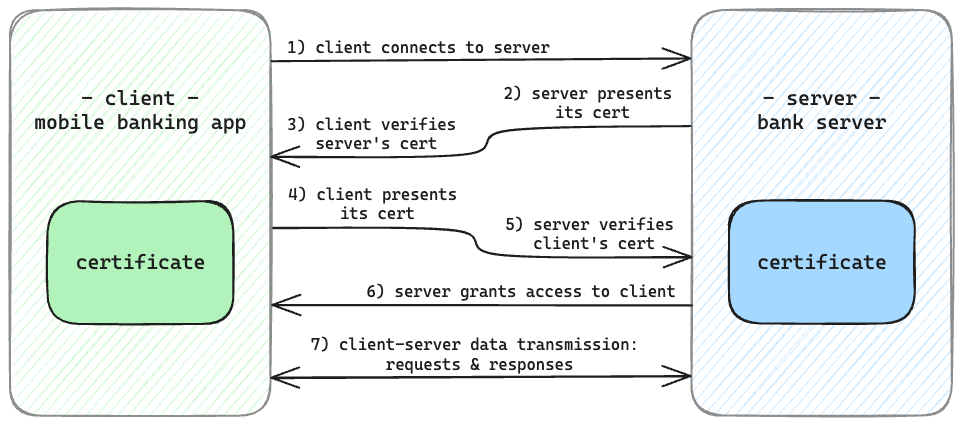

# Mutual Transport Layer Security (mTLS / Mutual TLS)

## TLS vs mTLS
**TLS** is a security protocol used to enforce secure communication between the 2 parties at each end of a network connection (i.e., client & server) by encrypting data during transmission over the network
- The client verifies the server's identity by means of a digital certificate issued by a certificate authority (CA)

**mTLS** is an extension of TLS, with an extra layer of security achieved by mandating mutual authentication,   which ensures both parties are who they claim to be
- The server has to prove its identity to the client, **AND** the client has to prove its identity to the server,   also through presenting a digital certificate during the handshake process

| | Transport Layer Security | Mutual Transport Layer Security |
|-----|------|-------|
| *Acronym* | TLS | Mutual TLS / mTLS |
| *Authentication Process* | 1-way | 2-way |
| *Security Level* | Lower | Higher |

## Where is mTLS Frequently Used?
mTLS is widely used in scenarios which require robust 2-way authentication mechanisms,  
where it is crucial to ensure that sensitive, confidential data (e.g., user credentials & financial data)   
is protected against potential security breaches and data vulnerabilities during exchange between the client & the server

Examples use cases - using mTLS to authorise:
- Clients into applications
- APIs used in business-to-business (B2B) communication
- Internet of Things (IoT) devices
- Devices attempting to connect to a corporate network

## Example Application of mTLS: Mobile Banking App
### Step-by-step overview of what happens when a customer uses their mobile banking app
1. The customer logs onto the banking app with their credentials (i.e., username & password) to establish their identity

2. The banking app establishes a secure connection with the bank's servers using the TLS protocol

3. A 2-way authentication process occurs during the handshake: 
  - The banking app (the client) and the bank's server prove their authenticity to each other by presenting to each other their signed digital certificates
  - The 2 parties validate each other's certificate to confirm they're communicating with the legitimate client/server

This process ensures that:
- Only authorised clients - the banking app - are allowed to access services provided by the bank's servers
- Only trusted servers - those that belong to the bank - are allowed to provide services to the client

Ultimately, the use of mTLS enables
- The max level of trust & security for the communication channel between clients & bank servers to be maintained
    - This channel is confidential (i.e., eavesdropping-resistant) and authentic (i.e., tampering-resistant)
- All the sensitive data being transmitted (e.g., financial transaction history & account balances) to be protected

